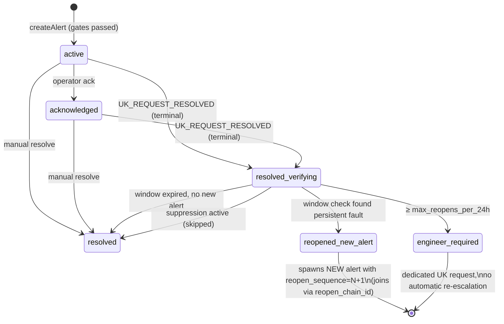
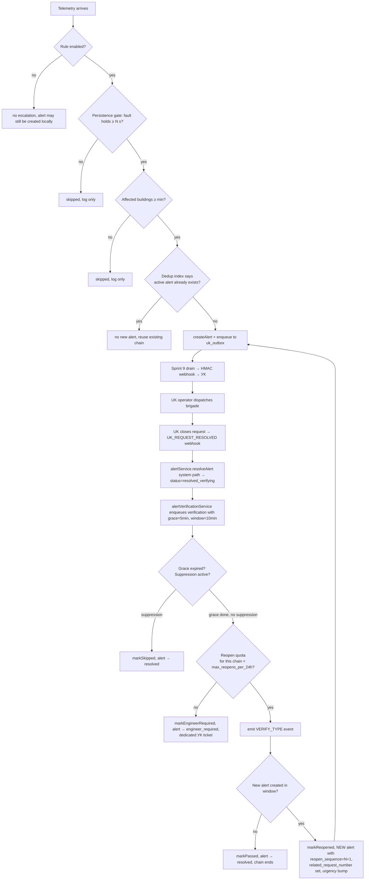

# Sprint 10 — Alert escalation business process

> **Date**: 2026-05-24
> **Status**: shipped (dormant — `ALERT_VERIFICATION_ENABLED=false` on prod)
> **Authors**: chief-architect + biz-sys-analyst pipeline (Sprint 10)
> **Scope**: 5 alert types, 8 alert_rules, 2 new statuses, 1 verification queue, 1 suppression table, 1 audit log, 1 admin UI panel

---

## 1. Problem statement

After the UK integration channel went bi-directional in prod (Sprint 9.2.1, 2026-05-23), two operational gaps and one UX gap surfaced:

| # | Gap | Cost in production |
|---|---|---|
| G1 | **No trigger boundary.** Every WARNING+ alert immediately created a УК request. Transient flashes / sensor noise (<60 s) generated false tickets. | ~30–90 min of brigade time per false dispatch. |
| G2 | **No reopen cycle.** When УК closed a request ("Принято"), physical reality was not re-checked. If the sensor still showed water/overload, the alert stayed `resolved` and no new ticket fired. | Silent persistence of real faults; both operator dashboards lied. |
| G3 | **No operator UI for rules.** `alert_rules` was editable only via SQL. Operators could not see which alert types escalate to УК, tune thresholds, or temporarily disable an escalation. | Engineering bottleneck on every threshold tune. |

The hard business invariant we agreed on with the УК team and the InfraSafe operator group:

> **Physical reality wins over administrative state.** And **the operator must see and change the integration schema through the UI**, not SQL.

---

## 2. Decision matrix — what fires a УК ticket

Each row of `alert_rules` carries the full per-(type, severity) policy. Defaults are conservative; the admin UI lets the operator tune them per environment.

| Trigger condition | Threshold (default) | Source |
|---|---|---|
| `enabled` | true for all 5 types in v1 | UI toggle, audited in `alert_rule_changes` |
| Persistence — fault must hold for ≥N s before we escalate | CRITICAL: 10 s · WARNING: 60 s · LEAK_DETECTED: 15 s | SQL aggregation against `metrics` for LEAK+controller path; other types fail-open in v1 |
| Affected buildings — magistral aware | ≥1 building (typically tuned to 2 for transformer-load magistrals) | `alertForwarder.resolveBuildingIds()` |
| Cooldown (existing) | 15 min between identical alerts | `alertService.lastChecks` Map |
| Dedup (existing) | partial UNIQUE on `(infra_type, infra_id, type) WHERE status IN ('active','acknowledged')` | DB index, Sprint 9 |
| Reopen quota | ≤ `max_reopens_per_24h` (default 3) per reopen_chain | `AlertRequestMap.countRecentReopensForChain()` |
| Reopen cooldown | ≥ `reopen_cooldown_min` (default 30 min) | `alertVerificationService` |

If **all** gates pass and the rule is `enabled`, the alert is enqueued to `uk_outbox` and the Sprint 9 outbox drain pushes the HMAC webhook to УК.

---

## 3. State machine

The alert lifecycle was minimally extended — two new statuses, one new column (`reopen_chain_id`).

**Why two-stage `resolved` (not just one).** A direct `resolved` is terminal: the operator/UK closed it, we stop watching. `resolved_verifying` keeps a 5-minute grace + 10-minute observation window so the brigade has time to leave the site AND we collect enough sensor readings to know if the fault is really gone. Decoupling those two states lets the existing UI (which filters by `resolved`) keep working unchanged.

**Why reopen creates a NEW alert_id, not a status flip.** The Sprint 9 outbox path already keys idempotency on `(alert_id, building_external_id)`. A fresh `alert_id` is the cheapest way to unlock the dedup index and reuse the entire fan-out → HMAC webhook pipeline without schema gymnastics.

**Why `engineer_required` is a terminal sink.** After the reopen quota is hit, we don't want a flapping sensor to keep paging dispatchers. УК receives a single "инженерный разбор" request that an engineer can investigate; further automatic escalation is paused on this chain.

---

## 4. Suppression — operator escape hatch

When the operator knows a sensor is broken / under maintenance / part of planned work, they can suppress further escalation **without disabling the rule globally**.

| Field | Notes |
|---|---|
| keyed on | `(infrastructure_type, infrastructure_id, alert_type)` — NOT `alert_id`, so it survives reopen cycles |
| `suppress_until` | TIMESTAMPTZ, capped at 24 h in v1 |
| `reason` | enum: `faulty_sensor` · `maintenance` · `planned_work` · `other` |
| `comment` | free text |
| Cleared by | operator (audited) OR automatic on `suppress_until` |

`alertVerificationService` consults `AlertSuppression.isActive()` before emitting any `VERIFY_*` event. If active → verification is marked `skipped`, no reopen.

---

## 5. Admin UI — «Правила эскалации»

Sprint 10 PR-5 added a new sub-tab inside the existing "Интеграция УК" admin panel:

- All 8 rules visible grouped by `alert_type`, with per-rule stats (alerts in last 7d / escalated to УК / reopens).
- Inline-editable fields: `enabled`, `min_persistence_seconds`, `min_affected_buildings`, `verification_grace_seconds`, `verification_window_seconds`, `max_reopens_per_24h`, `reopen_cooldown_min`, `reopen_urgency_bump`, `uk_category`, `uk_urgency`, `description`.
- `PATCH /api/integration/rules/:id` writes one `alert_rule_changes` row per changed field (diff-then-PATCH-then-audit), `POST /api/integration/rules/:id/toggle` for the enabled flag, `GET /api/integration/rules/:id/history` for the per-rule audit log.
- Disabling a `CRITICAL` rule shows a confirmation modal because that pauses automatic УК escalation for the most severe events.
- Client-side bounds in `public/utils/ukRulesValidation.js` mirror the server-side `EDITABLE_FIELDS` whitelist (server is the source of truth for rejection — UI just prevents nonsense input).

---

## 6. Operator decision flow

---

## 7. Key files (jump list)

| Purpose | Path |
|---|---|
| Plan | `~/.claude/plans/tingly-munching-badger.md` |
| Rules schema | `database/migrations/024_alert_rules_extensions.sql` |
| Verification queue | `database/migrations/025_alert_verifications.sql` |
| Suppression table | `database/migrations/026_alert_suppressions.sql` |
| Status enum + reopen_chain | `database/migrations/027_alert_lifecycle_v2.sql` |
| `alert_types` catalog drop | `database/migrations/028_drop_alert_types_catalog.sql` |
| Audit log | `database/migrations/029_alert_rule_changes.sql` |
| Persistence + buildings gates | `src/services/alertService.js` (`_checkPersistenceGate`, `_checkAffectedBuildingsGate`) |
| Verification worker singleton | `src/services/alertVerificationService.js` |
| Reopen + urgency bump + payload extension | `src/services/uk/alertForwarder.js` |
| Suppression handlers | `src/controllers/alertController.js` (`suppressAlert`, `clearSuppression`, `listSuppressions`) |
| Rules editor handlers | `src/routes/integrationRoutes.js` (`/rules/stats`, PATCH `/rules/:id`, `/toggle`, `/history`) |
| Admin UI panel | `admin.html` + `public/admin.js` `renderIntegrationRules` |
| Client-side validation | `public/utils/ukRulesValidation.js` |

---

## 8. Out of scope (Sprint 10.x / 11)

- LEAK sensor continuous checker (`leakCheckService`) — current LEAK is manual-create, verification works without continuous re-emission.
- "Бригада на месте" UK contract — needs UK API extension, coordinate after Sprint 10.
- Seasonal HEATING rules (`active_from` / `active_to`) — Q4 2026.
- Stuck-sensor anomaly detection (stddev=0 widget) — separate analytics widget.
- Sprint 10 → frontend-redesign branch merge — Sprint 11.
