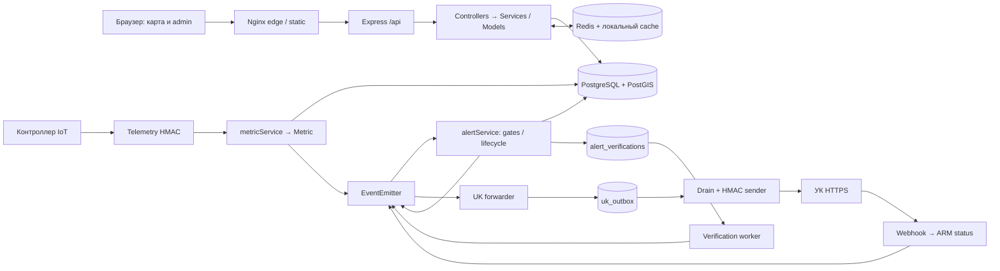

<!--
Перенесено из локального AUDIT_REPORT.md (вывод скилла /audit) 17.09.2026 без
правок содержания: абсолютные пути машины заменены на пути от корня репозитория,
добавлена эта шапка. Причина переноса — преамбула docs/BACKLOG.md: вывод /audit
лежит в .gitignore, и августовский аудит 2026 года уже «остался только на машине,
где запускался». Чтобы это не повторилось, сентябрьский отчёт закоммичен как
доказательная база, а сами находки сведены в docs/BACKLOG.md по единой шкале.

Ссылки вида `(src/файл.js:123)` — пути и строки на момент снятия аудита
(коммит d602f0f8), не кликабельные ссылки.

Артефакты прогонов в /private/tmp/ — временные файлы машины аудита, их нет.
-->

# Аудит InfraSafe

Дата: **2026-09-08**, Asia/Tashkent. Ветка **main**, commit **d602f0f8d5703a015475e9db5250b2ba16e3f380**. Исходное рабочее дерево чистое. Режим: чтение кода, конфигураций и выбранной истории Git; локальные проверки без рабочих БД и внешних бизнес-операций. Единственный созданный файл проекта — этот отчёт.

## 1. Executive summary

1. Подтверждены **26 находок: P0 — 0, P1 — 10, P2 — 14, P3 — 2**. P1 означает высокий риск при описанных условиях, а не утверждение о произошедшем production-инциденте.
2. Главный AppSec-риск — обход уже включённой 2FA: знания пароля достаточно для получения нового TOTP-секрета через штатный setup endpoint, после чего доступен полный вход (**A-01**). [totpService.js:115](src/services/totpService.js:115), [authController.js:393](src/controllers/authController.js:393).
3. Отзыв сессий при повторном использовании refresh-токена не достигается через обычный HTTP-путь; recovery-коды также не работают с установленной otplib (**A-02, A-11**). [auth.js:129](src/middleware/auth.js:129), [totpService.js:246](src/services/totpService.js:246).
4. Алерт и намерение отправить заявку УК сохраняются раздельно. Аналогичный разрыв на обратном пути позволяет навсегда потерять автоматическое разрешение алерта после временной ошибки (**A-03, A-04**). [alertService.js:1006](src/services/alertService.js:1006), [requestProcessor.js:171](src/services/uk/requestProcessor.js:171).
5. Есть прямые риски для работы оператора: редактирование здания может удалить инфраструктурные связи, карта может показывать норму при offline-контроллере или неисправной ГВС, а единичный критический скачок подавляет устойчивый WARNING (**A-05–A-08**). [Building.js:206](src/models/Building.js:206), [script.js:1622](public/script.js:1622), [alertQueries.js:182](src/services/alert/alertQueries.js:182).
6. Деплой имеет рабочие механизмы staging, образов и миграций, но отдельные ветки ошибки обходят rollback, а повторная выкатка после rollback может смешать версии HTML/CSS и приложения (**A-09, A-10, A-13**). [update-production.sh:143](update-production.sh:143), [update-production.sh:332](update-production.sh:332).
7. Линтер прошёл; **214 suites / 3345 tests passed**, покрытие строк **92,38%**, ветвей **86,21%**. Однако отдельные тесты закрепляют небезопасный контракт или подменяют библиотеку именно там, где возник дефект (**A-16**). [totpService.test.js:243](tests/jest/unit/totpService.test.js:243), [totpService.test.js:394](tests/jest/unit/totpService.test.js:394).
8. Основные защитные механизмы присутствуют: default-deny, ограниченный алгоритм JWT, актуальная проверка пользователя в БД, CSRF Origin guard, SQL-параметры, HMAC, очереди и проверки миграций. Приоритет следующих работ — исправление подтверждённых сценариев и проверки границ между модулями; оснований для переписывания платформы не найдено. [auth.js:53](src/middleware/auth.js:53), [csrfOriginGuard.js:84](src/middleware/csrfOriginGuard.js:84), [AlertVerification.js:140](src/models/AlertVerification.js:140).

## 2. Scorecard

Оценки экспертные, по исследованному checkout; 10 означает отсутствие существенных обнаруженных проблем в соответствующей области.

| Фаза | Оценка | Обоснование |
|---|---:|---|
| Архитектура | **6/10** | Модульный монолит и durable workers оправданы, но две передачи бизнес-событий остаются ненадёжными: A-03/A-04. |
| Код | **6/10** | Содержательные тесты и транзакционные участки сочетаются с подтверждёнными ошибками DTO, пагинации и классификации аварий: A-05–A-08. |
| Простота | **7/10** | Полностью лишние runtime-модули и прямые npm-зависимости не подтверждены; остаются небольшой неподключённый API и дублирующий backup-путь: A-21/A-25. |
| Безопасность | **4/10** | Базовая защита внедрена последовательно, но второй фактор обходится штатным API, а replay-защита имеет логические дефекты: A-01/A-02/A-12. |
| Инженерные практики | **6/10** | CI включает coverage, DB/E2E и security checks, однако публикация образа и восстановление деплоя не обеспечивают ожидаемые гарантии: A-09/A-10/A-14. |

## 3. Разведка, карта проекта и границы проверки

### Фактический стек и точки входа

| Область | Устройство и основание |
|---|---|
| Backend | Node.js **>=22** по manifest, Express **4.22.2** по lockfile; CommonJS, вход **src/server.js**, запуск **npm start**. Документация ещё называет Node 20+. [package.json:5](package.json:5), [package.json:43](package.json:43), [package-lock.json:4252](package-lock.json:4252), [README.md:13](README.md:13). |
| HTTP | Инициализация dotenv → validateEnv → middleware → /api router → обработчик ошибок. Телеметрия подключена до default-deny, защищена отдельным HMAC. [server.js:1](src/server.js:1), [server.js:176](src/server.js:176), [routes/index.js:87](src/routes/index.js:87), [routes/index.js:139](src/routes/index.js:139). |
| Frontend | HTML в **frontend-html/**, vanilla JS в **public/**, CSS и изображения отдельно; Leaflet/Chart.js, глобальные объекты страниц. esbuild выполняет минификацию с **bundle:false**, результат в **public/dist/**. [docker-compose.unified.yml:351](docker-compose.unified.yml:351), [build/esbuild.config.mjs:66](build/esbuild.config.mjs:66), [eslint.config.js:29](eslint.config.js:29). |
| Данные | pg Pool, SQL в моделях и части сервисов, PostgreSQL 15/PostGIS; migrations до **043**, отдельный host-side runner. [database.js:14](src/config/database.js:14), [docker-compose.unified.yml:167](docker-compose.unified.yml:167), [database/migrations/CLAUDE.md:110](database/migrations/CLAUDE.md:110). |
| Redis | Общий клиент, cache/rate limits/nonce dedup, fallback в память при недоступности; Redis URL обязателен для production, фактическое здоровье учитывается отдельно. [redisClient.js:54](src/utils/redisClient.js:54), [redisClient.js:81](src/utils/redisClient.js:81), [env.js:18](src/config/env.js:18). |
| Контейнеры | Основной app — immutable multi-stage image Node 22, runtime без devDependencies и с непривилегированным пользователем; edge nginx, frontend nginx, Postgres, Redis. Production app опубликован только на loopback. [Dockerfile.unified:23](Dockerfile.unified:23), [Dockerfile.unified:34](Dockerfile.unified:34), [Dockerfile.unified:45](Dockerfile.unified:45), [docker-compose.unified.yml:62](docker-compose.unified.yml:62). |
| Окружения | dev compose; unified base с отдельными staging/profk overrides; .env и .env.prod; секреты исключены из build context. [docker-compose.unified.yml:79](docker-compose.unified.yml:79), [docker-compose.staging.yml:24](docker-compose.staging.yml:24), [docker-compose.profk.yml:4](docker-compose.profk.yml:4), [.dockerignore:14](.dockerignore:14). |
| Generator | Самостоятельный ES module package, Express + node-cron, вход **generator/src/server.js**; JSON-файл состояния, отдельный Node 20 image. [generator/package.json:5](generator/package.json:5), [generator/src/server.js:239](generator/src/server.js:239), [generator/src/store.js:5](generator/src/store.js:5), [generator/Dockerfile:15](generator/Dockerfile:15). |
| CI | Четыре workflow: основной lint/test/coverage/DB/audit/gitleaks/image, отдельные E2E, migration E2E и CodeQL. Это проверка конфигурации CI; статусы удалённых запусков и branch protection не проверялись. [ci.yml:35](.github/workflows/ci.yml:35), [e2e-nightly.yml:1](.github/workflows/e2e-nightly.yml:1), [migrate-test.yml:1](.github/workflows/migrate-test.yml:1), [codeql.yml:1](.github/workflows/codeql.yml:1). |

Стрелки через EventEmitter означают передачу в памяти, а не подтверждённую запись в очередь. Именно промежутки **alert → forwarding intent** и **ARM status → resolve intent** имеют дефекты A-03/A-04. Основание потоков: [metricService.js:200](src/services/metricService.js:200), [metricService.js:246](src/services/metricService.js:246), [alertEvents.js:30](src/events/alertEvents.js:30), [alertForwarder.js:494](src/services/uk/alertForwarder.js:494), [requestProcessor.js:193](src/services/uk/requestProcessor.js:193).

### Архитектурные выводы

- **Направление зависимостей.** В графе 135 JS-модулей src не обнаружено циклов по литеральным относительным require, включая вызовы внутри функций. Это не доказательство отсутствия динамических циклов. EventEmitter действительно разрывает прямые импорты между analytics/alerts/UK. Заявленная строго трёхслойная схема неточна: admin lists обращаются к DB helper прямо из controllers, а User зависит от cacheService — A-26. [alertEvents.js:10](src/events/alertEvents.js:10), [adminBuildingController.js:32](src/controllers/admin/adminBuildingController.js:32), [User.js:33](src/models/User.js:33).
- **Ответственность модулей.** public/admin.js — около 3983 строк, public/script.js — 2263, alertService.js — 1730. Существенен не размер сам по себе, а совместное размещение загрузки справочников/форм/сохранения и классификации/persistence/lifecycle. Эти границы проявились в A-05–A-08. Дробление frontend до появления модульного графа лишь добавит глобальные связи; массовое разбиение не предлагается. [admin.js:2357](public/admin.js:2357), [admin.js:3183](public/admin.js:3183), [alertService.js:542](src/services/alertService.js:542), [build/esbuild.config.mjs:66](build/esbuild.config.mjs:66).
- **Ошибки.** Центральный обработчик скрывает детали 500 и пишет correlation ID; часть HTTP-контроллеров возвращает ошибки самостоятельно. Основной доказанный риск — поглощённые ошибки с ложным успехом или без повторной обработки, перечисленные в A-03/A-04/A-24. [errorHandler.js:14](src/middleware/errorHandler.js:14), [waterLineController.js:45](src/controllers/waterLineController.js:45).
- **Состояние и конкурентность.** DB dedup и FOR UPDATE SKIP LOCKED защищают часть alert lifecycle. Cache L1 и TOTP replay Map остаются process-local; это необходимо учитывать до scale-out. Потеря Redis не останавливает процесс, а переводит ряд механизмов в локальный режим. Несколько работающих app-реплик в этом аудите не установлены. [alertService.js:1001](src/services/alertService.js:1001), [AlertVerification.js:140](src/models/AlertVerification.js:140), [totpService.js:31](src/services/totpService.js:31), [redisClient.js:86](src/utils/redisClient.js:86).
- **Отказоустойчивость.** Есть pool connection timeout, DB statement timeout, circuit breakers, UK timeout/запрет redirects, outbox retries и advisory locks. Compose описывает одиночные app/Postgres/Redis на хосте; HA PostgreSQL/автоматический failover этими файлами не предоставляются. Производительность под реальной нагрузкой и достаточность лимитов не измерялись. [database.js:23](src/config/database.js:23), [database.js:37](src/config/database.js:37), [analyticsService.js:33](src/services/analyticsService.js:33), [ukWebhookClient.js:152](src/clients/ukWebhookClient.js:152), [mvRefreshService.js:145](src/services/mvRefreshService.js:145).
- **Документация.** Проверены AGENTS.md, CLAUDE.md, README и инструкции tests/migrations. Расхождения, влияющие на работу, вынесены в A-15/A-20/A-23/A-26; счётчики тестов и упоминания старых вариантов auth не использованы как источник фактов о текущем коде.

## 4. Находки

**S** — локальная задача, ориентировочно до одного инженерного дня; **M** — несколько дней с проверкой затронутого сценария; **L** — изменение нескольких подсистем, обычно больше недели. Оценки включают целевые regression tests, но не ожидание production-окна.

| ID | Серьёзность | Категория | Файл:строка | Описание и условия проявления | Рекомендация | Затраты |
|---|---|---|---|---|---|---|
| A-01 | **P1** | AuthN / 2FA | [authRoutes.js:324](src/routes/authRoutes.js:324), [totpService.js:115](src/services/totpService.js:115), [User.js:205](src/models/User.js:205), [authController.js:353](src/controllers/authController.js:353) | Знание пароля даёт temp token; setup повторно выдаёт новый секрет уже enabled-аккаунту. UPDATE сохраняет enabled=true, затем verify принимает новый OTP и выдаёт полную сессию. Старый второй фактор не нужен. | Запретить setup для enabled MFA; атомарный guard записи; отдельный reset с полной повторной аутентификацией. | **M** |
| A-02 | **P1** | AuthN / refresh replay | [auth.js:129](src/middleware/auth.js:129), [authService.js:328](src/services/authService.js:328), [authService.js:484](src/services/authService.js:484) | Middleware отклоняет consumed refresh до service, поэтому обычный поздний replay не запускает отзыв сессий. Если похититель первым обменял токен, повтор владельца не отзывает сессию похитителя. | Централизовать проверенный consume/reuse flow; endpoint-тест delayed replay за пределами grace interval. | **M** |
| A-03 | **P1** | Архитектура / доставка | [alertService.js:1006](src/services/alertService.js:1006), [alertService.js:1098](src/services/alertService.js:1098), [alertForwarder.js:444](src/services/uk/alertForwarder.js:444), [alertForwarder.js:494](src/services/uk/alertForwarder.js:494) | При включённой интеграции INSERT алерта, ARM и enqueue не атомарны. Crash после INSERT или отказ до enqueue оставляют активный алерт без заявки. Обычный outbox worker не восстанавливает отсутствующие строки; повторные алерты подавляет dedup. | Сохранять durable intent в транзакции с алертом; повторяемо материализовать outbox. Проверить crash/retry между этапами. | **M** |
| A-04 | **P1** | Архитектура / feedback | [requestProcessor.js:171](src/services/uk/requestProcessor.js:171), [requestProcessor.js:193](src/services/uk/requestProcessor.js:193), [alertService.js:1665](src/services/alertService.js:1665) | ARM становится resolved до асинхронного resolveAlert. Ошибка БД/VERIFY_LOCK_BUSY лишь логируется; reconcile видит ARM=resolved и ничего не делает. Алерт остаётся active, verification/reopen не запускаются. | Durable resolve intent либо reconcile по фактическому состоянию алерта; идемпотентная повторная финализация. | **M** |
| A-05 | **P1** | Корректность / аварии | [alertQueries.js:176](src/services/alert/alertQueries.js:176), [alertQueries.js:182](src/services/alert/alertQueries.js:182), [alertGates.js:104](src/services/alert/alertGates.js:104), [alertService.js:594](src/services/alertService.js:594) | Один критический сэмпл выбирает CRITICAL на окно 600 секунд, но gate требует минимум два. Последующие устойчивые WARNING-сэмплы не проверяются как WARNING; авария может не породить алерт до истечения окна. | Выбирать высший уровень, прошедший свой persistence gate; после отказа CRITICAL проверять WARNING. | **M** |
| A-06 | **P1** | Frontend / потеря данных | [admin.js:2362](public/admin.js:2362), [transformerController.js:10](src/controllers/transformerController.js:10), [admin.js:1727](public/admin.js:1727), [admin.js:3183](public/admin.js:3183), [Building.js:206](src/models/Building.js:206) | Справочник ограничен первой страницей из 10 объектов. Текущий FK за её пределами не имеет option, select становится пустым. Submit пропускает поле, fixed UPDATE записывает NULL: смена названия здания удаляет связь. | Полный/поисковый справочник с текущей option; явный контракт omitted/null и сохранение неизменённых связей. | **M** |
| A-07 | **P1** | Frontend / достоверность карты | [buildingMetricsService.js:74](src/services/buildingMetricsService.js:74), [buildingMetricsService.js:99](src/services/buildingMetricsService.js:99), [script.js:1596](public/script.js:1596), [script.js:1637](public/script.js:1637), [script.js:1923](public/script.js:1923) | Карта игнорирует controller_status и возраст timestamp, оценивая последние сохранённые числа. Offline-контроллер может оставаться «нормой», время HTTP-опроса обновляется. Частичная метрика с leak_sensor=true без первой фазы также не попадает в ветку обработки протечки. | Отделить наличие/свежесть данных от конкретного сенсора; отобразить offline и время измерения; тестировать partial telemetry. | **M** |
| A-08 | **P1** | Frontend / DTO | [buildingMetricsService.js:97](src/services/buildingMetricsService.js:97), [script.js:1622](public/script.js:1622), [script.js:1637](public/script.js:1637), [script.js:1644](public/script.js:1644) | API отдаёт has_hot_water, карта читает hot_water. Отсутствующее поле делает isHotWaterOK=true; нулевые давления ГВС при исправных электричестве/ХВС отображаются как норма. | Единое имя поля во всех потребителях; проверка карты на фактическом DTO. | **S** |
| A-09 | **P1** | Deploy / rollback | [update-production.sh:161](update-production.sh:161), [update-production.sh:306](update-production.sh:306), [update-production.sh:332](update-production.sh:332), [update-production.sh:342](update-production.sh:342) | После переключения app ошибки nginx test и edge smoke заканчиваются явным exit 1. Единственный trap — ERR; exit и обработанные if/OR-ветки его не запускают. Откат, обещанный комментариями, не происходит. | Единый failure handler с учётом стадии; поведенческие проверки обеих веток отказа. | **S** |
| A-10 | **P1** | Deploy / повторный запуск | [update-production.sh:143](update-production.sh:143), [update-production.sh:196](update-production.sh:196), [update-production.sh:281](update-production.sh:281), [rebuild-frontend.sh:180](scripts/rebuild-frontend.sh:180) | Rollback возвращает старую static только в worktree, HEAD остаётся новым. При повторном deploy того же SHA merge уже up-to-date, старые HTML/CSS сохраняются; новый app/dist могут пройти verify, проверяющий JS. nginx-config также не восстанавливается этой командой. | Согласованное состояние релиза и явная поддержка retry; сценарий failure→rollback→same-SHA retry. Без безусловного удаления локальных изменений. | **M** |
| A-11 | **P2** | AuthN / recovery | [totpService.js:89](src/services/totpService.js:89), [totpService.js:246](src/services/totpService.js:246), [totpService.js:255](src/services/totpService.js:255) | Выпускаемые recovery-коды XXXX-XXXX сначала передаются в otplib как OTP. Реальная библиотека бросает ошибку длины, до bcrypt fallback выполнение не доходит; восстановление завершается 500. | Выбирать ветку по формату, корректно обрабатывать неверный OTP; тест с настоящей otplib. | **S** |
| A-12 | **P2** | HMAC / anti-replay | [telemetryHmac.js:97](src/middleware/telemetryHmac.js:97), [telemetryHmac.js:108](src/middleware/telemetryHmac.js:108), [webhookVerifier.js:126](src/services/uk/webhookVerifier.js:126), [webhookVerifier.js:144](src/services/uk/webhookVerifier.js:144) | Bytes подписи допускают uppercase/nonhex suffix, nonce key считается по исходной строке. Имея валидный подписанный пакет, можно повторять телеметрию с разными представлениями подписи в пределах временного окна. Для UK дополнительно действует event_id dedup. | Ровно 64 hex-символа и канонический nonce key из bytes/expected digest; case/suffix regression tests. | **S** |
| A-13 | **P2** | Deploy / Nginx | [update-production.sh:328](update-production.sh:328), [docker-compose.unified.yml:325](docker-compose.unified.yml:325), [docker-compose.profk.yml:14](docker-compose.profk.yml:14), [docker-compose.staging.yml:49](docker-compose.staging.yml:49) | nginx -t вызывается без -c, хотя master использует custom config. Проверяется другой файл; успешная отправка reload-сигнала не доказывает принятие нового custom config. | Передавать конфиг выбранного окружения; проверять его применение. | **S** |
| A-14 | **P2** | CI/CD / gates | [ci.yml:119](.github/workflows/ci.yml:119), [ci.yml:216](.github/workflows/ci.yml:216), [update-production.sh:225](update-production.sh:225) | Публикующий job не зависит от lint/test/audit/gitleaks. SHA image может появиться при ещё работающих/упавших соседних jobs; deploy проверяет наличие образа, не итог проверок. Настройки branch protection вне scope. | Публикация после обязательных проверок; gate нужных workflow при promotion. | **S** |
| A-15 | **P2** | Bootstrap / документация | [README.md:181](README.md:181), [docker-compose.dev.yml:170](docker-compose.dev.yml:170), [99_schema_migrations_baseline.sql:55](database/init/99_schema_migrations_baseline.sql:55), [User.js:46](src/models/User.js:46) | Quick start поднимает init до 017 без migrate up. Текущая auth projection требует sessions_revoked_at из 043; чистый volume не соответствует приложению. CI E2E отдельно применяет миграции. | Единый документированный bootstrap с migrate up и schema readiness; проверить чистый volume. | **S/M** |
| A-16 | **P2** | Качество тестов | [totpService.test.js:243](tests/jest/unit/totpService.test.js:243), [totpService.test.js:394](tests/jest/unit/totpService.test.js:394), [ukIntegrationServiceTest.test.js:790](tests/jest/unit/ukIntegrationServiceTest.test.js:790), [deployWiring.test.js:208](tests/jest/unit/deployWiring.test.js:208) | Тесты закрепляют замену enabled TOTP и no-op по resolved ARM без проверки алерта; otplib подменена в recovery-тесте; deploy проверяется regex. Высокое покрытие не проверяет эти сквозные свойства. | Endpoint/DOM/SQL/failure-injection сценарии для A-01–A-13; оставить unit-тесты полезных локальных контрактов. | **M** |
| A-17 | **P2** | Локальные проверки | [package.json:88](package.json:88), [package.json:90](package.json:90), [jest.e2e.config.js:2](tests/jest/e2e/jest.e2e.config.js:2) | Jest обходит вложенные worktree. В текущем checkout обнаружены duplicate mock otplib и Haste package collisions; запуск захватил тест другой ветки. | modulePathIgnorePatterns для .claude/worktrees и иных используемых worktree-каталогов; согласовать основной/E2E конфиги. | **S** |
| A-18 | **P2** | Конфигурация | [envSchema.js:48](src/config/envSchema.js:48), [envSchema.js:137](src/config/envSchema.js:137), [authCookies.js:53](src/utils/authCookies.js:53), [authService.js:789](src/services/authService.js:789), [ukWebhookClient.js:68](src/clients/ukWebhookClient.js:68) | Validator принимает 1/uppercase/trimmed values, потребители неодинаковы. UK_USE_NEXT_SECRET=1 продолжает старый ключ; AUTH_BLACKLIST_FAIL_OPEN=1 не включает override. SECURE_COOKIES=1 не работает вне production; в production Secure включён независимо. | Один bool parser либо строгая согласованная грамматика; тестировать значения на потребителях. | **S** |
| A-19 | **P2** | Логи / 12-factor | [logger.js:37](src/utils/logger.js:37), [logger.js:43](src/utils/logger.js:43), [waterLineController.js:45](src/controllers/waterLineController.js:45) | Console выводит лишь timestamp/level/message. При LOG_CONSOLE_ONLY=true исчезает единственный JSON sink, теряются stack/endpoint/id и другие metadata. Correlation ID HTTP-логов сохраняется внутри message. | JSON Console в console-only режиме; проверить сериализованные metadata. | **S** |
| A-20 | **P2** | AppSec / CodeQL | [codeql-config.yml:17](.github/codeql/codeql-config.yml:17), [codeql-config.yml:49](.github/codeql/codeql-config.yml:49), [authCookies.js:116](src/utils/authCookies.js:116) | CSRF query глобально исключён на основании «API Bearer-only». Сейчас используются cookie; обоснование устарело и оставляет слепую зону анализа. Это не доказанный обход действующего Origin guard. | Пересмотреть исключение на текущем auth flow и обновить обоснование. | **S** |
| A-21 | **P2** | Backup / дублирование | [backup-database.sh:34](backup-database.sh:34), [backup-database.sh:38](backup-database.sh:38), [backup-database.sh:71](backup-database.sh:71), [backup-cron.sh:100](database/backup-cron.sh:100) | Ручной backup сначала выбирает первый PostGIS/Postgres-контейнер на хосте. При нескольких проектах возможен отказ либо успешный dump чужой БД с совпавшими именами. Есть отдельный backup-cron с явным контейнером. | Compose-scoped container id; тонкая обёртка над общим backup-путём. Потенциально убрать **70–90 строк** дублирования. | **S** |
| A-22 | **P2** | Зависимости / CI | [ci.yml:97](.github/workflows/ci.yml:97), [generator/package-lock.json:817](generator/package-lock.json:817), [generator/Dockerfile:15](generator/Dockerfile:15) | CI npm audit проверяет только основной пакет. Generator имеет отдельное дерево зависимостей и runtime image, не покрытые этим шагом; его audit сейчас возвращает 3 moderate package entries. Достижимый exploit этих advisories не подтверждён. | Добавить generator audit/image check; планово обновить lockfiles и согласовать Node runtime. | **S** |
| A-23 | **P2** | Generator / контракт API | [apiClient.js:144](generator/src/apiClient.js:144), [apiClient.js:146](generator/src/apiClient.js:146), [buildingMetricsService.js:119](src/services/buildingMetricsService.js:119), [apiClient.js:89](generator/src/apiClient.js:89), [authController.js:60](src/controllers/authController.js:60) | GET buildings-metrics не авторизован даже при API_STATIC_TOKEN; anonymous DTO не содержит controller_id, фильтр даёт пустой список. Login дополнительно ждёт JSON token, хотя API выдаёт cookies. Генератор сообщает успех без отправки метрик. | Согласовать auth GET/POST с текущим API; не расширять anonymous DTO и не возвращать JWT в JSON ради совместимости. | **M** |
| A-24 | **P2** | Generator / persistence | [docker-compose.generator.yml:16](docker-compose.generator.yml:16), [store.js:5](generator/src/store.js:5), [store.js:35](generator/src/store.js:35), [server.js:206](generator/src/server.js:206) | Named volume создаёт директорию на пути generator-data.json. writeFileSync получает EISDIR, ошибка поглощается, API подтверждает сохранение. После рестарта остаётся пустая конфигурация. | Монтировать writable каталог, файл хранить внутри; возвращать ошибку сохранения. | **S** |
| A-25 | **P3** | YAGNI / лишний API | [circuitBreaker.js:223](src/utils/circuitBreaker.js:223), [circuitBreaker.js:260](src/utils/circuitBreaker.js:260), [circuitBreaker.js:266](src/utils/circuitBreaker.js:266), [circuitBreaker.js:299](src/utils/circuitBreaker.js:299) | isAvailable, setFailureThreshold, setResetTimeout, createExternalServiceBreaker не имеют production-потребителей; найдены определения и собственные тесты присвоений/пресетов. Используемые breakers нужны. | Удалить четыре неподключённых API и только относящиеся к ним тесты: около **30 runtime + 49 test строк**, 0 зависимостей. | **S** |
| A-26 | **P3** | Архитектура / документация | [README.md:274](README.md:274), [adminBuildingController.js:32](src/controllers/admin/adminBuildingController.js:32), [analyticsService.js:307](src/services/analyticsService.js:307), [User.js:33](src/models/User.js:33) | README описывает строго Controllers→Services→Models, но DB helpers вызываются из admin controllers, SQL есть в services, модель User зависит от service кэша. Схема не отражает границы владения данными. | Зафиксировать допустимые исключения и владельцев запросов; переносить при изменении соответствующего модуля, без введения лишнего repository слоя. | **S** |

## 5. Проверка ключевых сценариев

### AppSec: локальные доказательства

Все нижеуказанные проверки выполнены без production, рабочих аккаунтов и сетевых отправок. Для сервисных proof использованы реальные crypto/otplib/bcrypt и подменённое в памяти хранилище.

| Находка | Проверка | Результат |
|---|---|---|
| A-01 | Enabled TOTP → generateSetup → verifyCode по новому секрету | initialTotpEnabled=true; secretChanged=true; totpStillEnabled=true; newCodeAccepted=true. |
| A-11 | Искусственный код формата XXXX-XXXX, выпускаемого генератором, через реальную otplib | Исключение **Token must be 6 digits, got 9**; recovery-код не погашен. |
| A-02 | Реальный authenticateRefresh, blacklist=true | HTTP 401; nextCalls=0 — service reuse handler недостижим этим путём. |
| A-12 | Реальная verifyTelemetrySignature, один body/timestamp, разные представления одной подписи | original=true; exactReplay=false; uppercaseReplay=true; suffixZZReplay=true; suffixYYReplay=true. |

Источник проверяемых функций: [totpService.js:107](src/services/totpService.js:107), [totpService.js:232](src/services/totpService.js:232), [auth.js:120](src/middleware/auth.js:120), [telemetryHmac.js:74](src/middleware/telemetryHmac.js:74).

Для A-05 проверена цепочка условий в коде: при одной фазе 170 В и следующих измерениях 190 В, две остальные фазы 220 В, CRITICAL классификация остаётся активной из-за прежнего сэмпла, а CRITICAL gate отвергает выбор. Динамический SQL-прогон этого нового сценария не выполнялся; замечание подтверждено несовместимыми предикатами и отсутствием fallback в прочитанном коде. [alertQueries.js:159](src/services/alert/alertQueries.js:159), [alertGates.js:75](src/services/alert/alertGates.js:75), [alertService.js:594](src/services/alertService.js:594).

A-03/A-04 подтверждены границами durable-записей, асинхронными обработчиками и отсутствием соответствующего восстановительного пути среди runtime call sites. Искусственные сбои на production не проводились. A-09/A-10/A-13 подтверждены управляющими конструкциями shell и составом восстановленных файлов; рабочий deploy не запускался.

### OWASP / ASVS

Использованы актуальные **OWASP Top 10:2025** и **ASVS 5.0.0**. ASVS L2 выбран как ориентир проверки административного приложения, а не заявленная сертификация. Сопоставление тематическое; полного прохода всех требований L2 не было. [OWASP Top 10](https://owasp.org/Top10/2025/), [ASVS](https://owasp.org/www-project-application-security-verification-standard/).

| Находки | OWASP Top 10:2025 | Область ASVS 5.0.0 | Вектор / необходимые условия |
|---|---|---|---|
| A-01 | A07 Authentication Failures | V6 Authentication, V7 Session Management | Пароль существующего MFA-аккаунта и доступ к штатным auth endpoints; прежний OTP не нужен. |
| A-02 | A07 Authentication Failures | V7 Session Management | Украденный refresh первым обменял атакующий; поздний replay владельца не запускает отзыв. |
| A-11 | A07 Authentication Failures | V6: recovery / lookup secrets | Владелец использует выданный recovery-код; утрата доступности восстановления, не обход входа. |
| A-12 | A07 Authentication Failures / A08 Software or Data Integrity Failures | V2 Validation and Business Logic, V6 Authentication | Доступен один подписанный пакет в пределах окна; новая подпись/секрет не требуются. |
| A-14, A-22 | A03 Software Supply Chain Failures | V13 Configuration | Публикация/эксплуатация артефакта без полного охвата обязательными проверками. |
| A-18, A-20 | A02 Security Misconfiguration | V13 Configuration, V3 Web Frontend Security | Разрешённое валидатором значение флага либо изменение cookie endpoints остаётся вне ожидаемой проверки. |
| A-19 | A09 Security Logging and Alerting Failures | V16 Security Logging and Error Handling | Включён LOG_CONSOLE_ONLY; расследование теряет структурированные metadata. |

Основания областей authentication/session: [ASVS Authentication](https://github.com/OWASP/ASVS/blob/v5.0.0/5.0/en/0x15-V6-Authentication.md), [ASVS Session Management](https://github.com/OWASP/ASVS/blob/v5.0.0/5.0/en/0x16-V7-Session-Management.md). Условия эксплуатации A-01/A-02/A-12 описаны в таблице находок; наличие общего OWASP-класса не повышает их приоритет автоматически.

### Что проверено без подтверждённой уязвимости

- В просмотренных маршрутах основной API применяет default-deny, admin guard к изменениям инфраструктуры и регистрации, HS256/issuer/audience и актуальное чтение role/is_active/lockout/cutoff. Подтверждённого обхода этих проверок отдельно от A-01/A-02 не найдено. [routes/index.js:139](src/routes/index.js:139), [authRoutes.js:146](src/routes/authRoutes.js:146), [auth.js:53](src/middleware/auth.js:53), [authService.js:554](src/services/authService.js:554).
- Подтверждённых SQL/command injection, path traversal, SSTI, LDAP/NoSQL injection не найдено в исследованных входах. Основной доступ к данным — PostgreSQL с параметрами и whitelist; соответствующие LDAP/NoSQL/SSTI подсистемы в исследованном runtime не обнаружены. [queryValidation.js:18](src/utils/queryValidation.js:18), [Building.js:206](src/models/Building.js:206).
- Подтверждённых XSS, SSRF, CSRF bypass или open redirect не найдено в просмотренных sinks/маршрутах. Есть DOMPurify/textContent, точный Origin guard, URL allowlist и запрет redirects UK client. Это ограниченный вывод по прочитанной поверхности. [domSecurity.js:27](public/utils/domSecurity.js:27), [csrfOriginGuard.js:84](src/middleware/csrfOriginGuard.js:84), [urlValidation.js:69](src/utils/urlValidation.js:69), [ukWebhookClient.js:152](src/clients/ukWebhookClient.js:152).
- Production HMAC/inventory secrets проверяются до подключения routes; отсутствие этих переменных не классифицировано как действующий production bypass. [server.js:1](src/server.js:1), [env.js:18](src/config/env.js:18).
- Генератор не имеет собственных auth middleware, но опубликован только на loopback. Его публичная доступность через edge не подтверждена; отдельная удалённая уязвимость на основании одного отсутствия middleware не заявляется. [generator/src/server.js:16](generator/src/server.js:16), [docker-compose.generator.yml:13](docker-compose.generator.yml:13).

### Секреты и история Git

Проверены выбранные подозрительные файлы через **git log --all -p**, включая .env-варианты, compose/deploy и связанные документы. Значения маскировались до вывода. В **623a059:.env.prod:27–28** действительно остались исторические JWT/refresh secrets. Однако поздний журнал фиксирует выполненную ротацию JWT/DB/UK/TOTP 2026-05-30: [security-audit.md:228](docs/audit/2026-05-29-security-audit.md:228). Поэтому действующая компрометация этими значениями не заявляется; production-ротация независимо не проверялась. Старый статус DEFERRED в [runbook:3](docs/runbook-12A-jwt-rotation-and-history-scrub.md:3) расходится с этим журналом.

Текущий .env не отслеживается Git; проверены только имена ключей и статус игнорирования. Литералы шаблона/тестовых учётных данных не объявлены действующими секретами. Полный локальный gitleaks scan всей истории не запускался; наличие соответствующего CI job подтверждено в [ci.yml:99](.github/workflows/ci.yml:99).

## 6. Выполненные проверки и зависимости

### Команды и результаты

| Проверка | Результат и ограничение |
|---|---|
| git status / rev-parse / чтение конфигураций | HEAD зафиксирован выше; до аудита tracked изменений не было. |
| npm run lint | **PASS**, exit 0; без --fix. |
| Первый npm test | Обнаружил nested-worktree Haste collisions; завершился на **listen EPERM** из-за запрета временного порта Supertest. Это не провал assertions текущего checkout. |
| Jest текущего checkout | Повтор с **--runInBand --no-cache --coverage**, modulePathIgnorePatterns для .claude/worktrees и .worktrees, разрешёнными локальными портами. **214/214 suites, 3345/3345 tests PASS**, 28,682 с. |
| Coverage | Statements **91,75%**, branches **86,21%**, functions **90,99%**, lines **92,38%**. Scope задан collectCoverageFrom: src, без server.js; это не покрытие всего frontend/generator. [package.json:96](package.json:96). |
| npm audit --json --package-lock-only | Проверены **оба lockfile**. Первоначально DNS недоступен в sandbox; повтор с разрешённым доступом к публичному npm registry завершён. Оба audit завершились exit 1 из-за найденных advisories; пакеты не устанавливались и не исправлялись. |
| Анализ require-графа | 135 JS-модулей src, циклы литеральных относительных импортов не обнаружены. |
| DB / migration / Docker E2E / нагрузочные тесты | **Не запускались:** изменяют состояние БД/контейнеров. Их код и CI-конфигурация прочитаны. Результат unit suite не подменяет эти проверки. |
| Локальные AppSec proofs | Четыре сценария из раздела 5, без рабочих БД и сети. |

Локальный runtime проверки: **Node v24.4.1 / npm 11.4.2**; CI/app image настроены на Node 22. Отчёт не утверждает, что локальный прогон заменяет CI на его версии runtime. Генератор не запускался, поскольку его entrypoint сразу стартует scheduler.

Команда итогового Jest использовала **LOG_CONSOLE_ONLY=true**, пустой **REDIS_URL**, выходные отчёты и coverage в **/private/tmp/**. Для воспроизводимости сохранены локальные [Jest JSON](/private/tmp/infrasafe-audit-jest-current.json), [Jest output](/private/tmp/infrasafe-audit-jest-current.txt), [lint output](/private/tmp/infrasafe-audit-lint.txt), [root audit JSON](/private/tmp/infrasafe-npm-audit.json), [generator audit JSON](/private/tmp/infrasafe-generator-audit.json). Это временные артефакты машины; основные результаты полностью приведены здесь.

### Фильтрация npm advisories

| Дерево | npm audit package entries | Зафиксированные версии |
|---|---|---|
| Основное | **4**: 3 moderate, 1 high; critical 0 | express 4.22.2, body-parser 1.20.6, qs 6.15.2; fast-uri 3.1.5 — **dev-only**. [package-lock.json:4252](package-lock.json:4252), [package-lock.json:4346](package-lock.json:4346), [package-lock.json:7319](package-lock.json:7319). |
| Generator | **3 moderate**, high/critical 0 | express 4.22.2, body-parser 1.20.6, qs 6.15.2. [generator/package-lock.json:356](generator/package-lock.json:356), [generator/package-lock.json:817](generator/package-lock.json:817). |

Количество package entries не равно числу независимых дефектов: express/body-parser наследуют предупреждения qs.

- **qs / GHSA-x5fp-wj9c-mxmx:** уязвимость требует **comma:true**. Такая настройка в исследованных runtime-путях не найдена. Не включена как подтверждённый удалённый DoS InfraSafe. Плановое обновление до исправленной ветки оправдано. [Advisory](https://github.com/advisories/GHSA-x5fp-wj9c-mxmx).
- **qs / GHSA-4mjr-xmp4-gh2g:** описанная ошибка возникает при сериализации объекта через **qs.stringify**, в частности после parse с разрешающими настройками. Runtime вызовов qs.stringify/соответствующего round-trip в src и generator/src не найдено; достижимая цепочка эксплуатации не подтверждена. [Advisory](https://github.com/advisories/GHSA-4mjr-xmp4-gh2g).
- **fast-uri / четыре high advisory:** запись dev-only; production app собирается с **npm ci --omit=dev**. Подтверждённой SSRF через эту зависимость в runtime нет. Её обновление относится к поддержке инструментального дерева, не к аварийному устранению доказанной SSRF приложения. [Dockerfile.unified:34](Dockerfile.unified:34), [host confusion advisory](https://github.com/advisories/GHSA-5jgf-p345-68v8), [IPv6 advisory](https://github.com/advisories/GHSA-f65p-4m7j-42xc), [percent decoding advisory](https://github.com/advisories/GHSA-fph4-wmhf-6fwf), [scheme normalization advisory](https://github.com/advisories/GHSA-jqff-g426-hqxp).

### Практики, которые стоит сохранить

ESLint использует flat config и строгий лимит предупреждений; отдельные правила заданы для backend, browser и generator. TypeScript/tsc и отдельный formatter-check в прочитанном manifest/основном CI не настроены; само по себе это не дефект. Найденные ошибки DTO обосновывают прежде всего проверку контракта API и поведения UI, без обязательного перевода всего проекта на TypeScript. [eslint.config.js:103](eslint.config.js:103), [package.json:9](package.json:9), [ci.yml:33](.github/workflows/ci.yml:33).

CI действительно запускает coverage и отдельные реальные DB-тесты; есть Docker E2E на PR/nightly, migration E2E, gitleaks и CodeQL, actions закреплены SHA. При этом A-14 относится к зависимости публикации от этих проверок, а A-16 — к качеству части сценариев. [ci.yml:62](.github/workflows/ci.yml:62), [ci.yml:68](.github/workflows/ci.yml:68), [ci.yml:74](.github/workflows/ci.yml:74), [e2e-nightly.yml:123](.github/workflows/e2e-nightly.yml:123).

Migration runner использует закреплённый commit, checksum, lock и контроль ACL; DB-тесты читают канонический DDL. Это полезнее ввода нового ORM или второго механизма миграций. Применённые миграции нельзя редактировать для исправления найденных проблем; нужны новые изменения схемы и проверка совместимости rollback image там, где схема меняется. [database/migrations/CLAUDE.md:14](database/migrations/CLAUDE.md:14), [database/migrations/CLAUDE.md:31](database/migrations/CLAUDE.md:31), [controllerStatus.db.test.js:38](tests/jest/db/controllerStatus.db.test.js:38).

Полностью неиспользуемые прямые npm-зависимости и целые runtime-модули не подтверждены. Используемые CRUD factories и circuit breakers не объявлены лишними. Обоснованная экономия для фазы простоты — **около 149–169 строк** в A-21/A-25, при сохранении поведения; это оценка удаления/консолидации, не измеренный patch.

## 7. Top-10 quick wins

Порядок учитывает эффект и размер отдельного изменения. Частичный quick win не закрывает всю находку, если остаются более широкие условия.

| № | Действие | Эффект / критерий готовности |
|---|---|---|
| 1 | A-01: запрет setup при enabled MFA в service и атомарной записи | Password-only temp token не может заменить существующий секрет; regression проходит через настоящий router. |
| 2 | A-08: унифицировать has_hot_water | Подключённая ГВС с нулевым давлением больше не отображается нормой. |
| 3 | A-11: различать TOTP/recovery до вызова otplib | Recovery проходит с настоящей библиотекой; неверный формат даёт ожидаемый 4xx. |
| 4 | A-12: строгий hex + канонический nonce | Повторы uppercase/suffix отклоняются одинаково с обычным replay. |
| 5 | A-09: свести late deploy failures к rollback handler | Ошибки nginx test и edge smoke гарантированно выполняют откат; проверено fake-командами. |
| 6 | A-13: nginx -t с конфигом выбранного окружения | Invalid custom config останавливает deploy до принятия конфигурации. |
| 7 | A-14: gate публикации образа | При failed lint/test/audit/gitleaks deployable SHA image не публикуется. |
| 8 | A-18: единый bool contract | Значение 1 одинаково понимается валидатором и реальным переключателем секретов. |
| 9 | A-17: исключить вложенные worktree из HasteMap | Обычный npm test сканирует текущий checkout без duplicate mocks/packages. |
| 10 | A-24: volume-directory + JSON внутри | Настройки генератора переживают restart; ошибка записи не возвращает success. |

A-02/A-03/A-04/A-05/A-06/A-07/A-10 требуют более широких проверок; они имеют высокий приоритет независимо от отсутствия в списке быстрых задач.

## 8. Roadmap рефакторинга и устранения рисков

Работы ниже **не выполнены**: отчёт является основанием для отдельной команды на изменения.

| Порядок | Задачи | Зависимости | Проверяемый результат |
|---|---|---|---|
| 1. Защита доступа | A-01, A-02, A-11, A-12; соответствующая часть A-16 | Можно выполнять параллельно с этапами 2–3 | Enabled MFA нельзя заменить по password-only temp; delayed refresh replay приводит к ожидаемому отзыву; recovery работает; изменённое представление подписи не обходит dedup. |
| 2. Безопасный деплой | A-09 + A-13 → A-10 → A-14 | Тест failure→retry нужен до признания rollback исправленным | Проверены отказы после app switch, publish, nginx test, smoke; повтор того же SHA восстанавливает согласованные app/HTML/CSS/dist/config. |
| 3. Сохранность данных и показаний | A-06; A-07 + A-08; A-05 | UI проверки используют DTO реального API; voltage — временную SQL-модель | Редактирование при 11+ справочных объектах сохраняет FK; offline/partial/GВС отображаются верно; WARNING не теряется после краткого CRITICAL. |
| 4. Надёжность интеграции | A-03 + A-04 | Сначала определить транзакционные границы; при новой таблице — новая совместимая миграция | Crash/failure до и после каждой durable-записи сходится к одной заявке на каждое затронутое здание и завершённому разрешению алерта без ручного исправления. |
| 5. Воспроизводимая разработка | A-15, A-17, A-22, A-23, A-24 | A-23 проверять после согласования auth contract этапа 1 | Чистый checkout/volume запускается по README; generator делает подтверждённую отправку и сохраняет настройки; оба dependency tree проверяются. |
| 6. Наблюдаемость и сопровождение | A-18, A-19, A-20, A-21 | Можно раньше при наличии ответственного инженера | Bool-флаги согласованы; console JSON сохраняет metadata; CodeQL exclusions актуальны; backup выбирает нужную БД. |
| 7. Упрощение | A-25, A-26; локальное выделение функций при работах этапа 3 | После закрытия поведенческих рисков | Удалены лишь доказанно неиспользуемые API; карта зависимостей соответствует коду; новые абстракции вводятся только при реальных повторяющихся потребителях. |

### Требует дополнительного подтверждения

- **Горизонтальное масштабирование TOTP:** replay Map локальна; несколько app-реплик и конкретная достижимость повторного OTP между ними не подтверждены. Перед масштабированием нужен shared atomic consume. [totpService.js:31](src/services/totpService.js:31).
- **Конкурентное погашение recovery:** read→compare→write неатомарно. Сейчас выдаваемые recovery-коды блокируются A-11; после её исправления обязательно проверить два одновременных consume и исключить повторное использование. [totpService.js:258](src/services/totpService.js:258), [User.js:219](src/models/User.js:219).
- **Production состояние:** не проверены реальные флаги, rotation status, branch protection, восстановление backup, ёмкость БД, нагрузка и HA вне compose. Эти неизвестные не представлены как фактические дефекты.
- **Глубина:** фазы распараллелены между тремя субагентами, затем агрегированы с проверкой критических цепочек. Выполнен углублённый анализ основных auth/telemetry/alert/UK/UI/deploy потоков и конфигураций, а не построчное прочтение каждого архивного документа, vendored файла и другой ветки.

Файл отчёта уже исключён существующим правилом [.gitignore:129](.gitignore:129); правило не изменялось. Поэтому git status остаётся чистым, хотя локальный AUDIT_REPORT.md создан.
